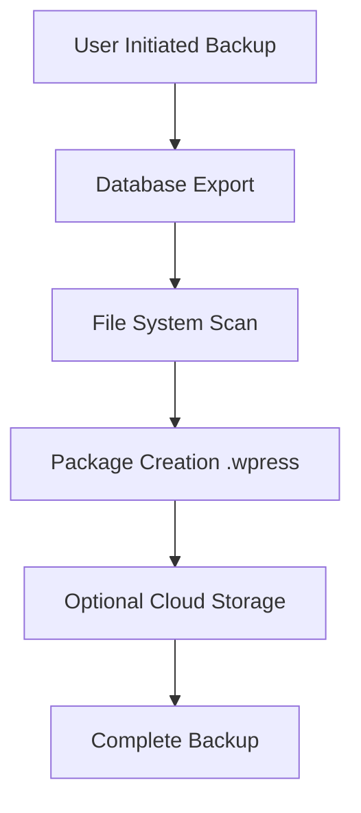
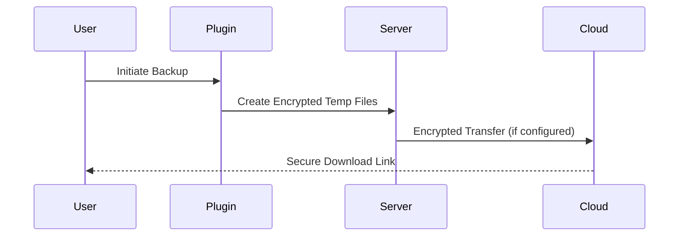

# All-in-One WP Migration Fork (v6.77)

  


This is a maintained fork of the original All-in-One WP Migration plugin, preserving critical functionality removed in later versions, including **import capabilities** and **WP-CLI integration**.

## Key Features ✨
- 32GB default file upload limit (easily configurable)
- Full site migration/backup capabilities
- WP-CLI support for advanced users
- Cross-platform compatibility
- Multisite support
- 100+ file compression algorithms



## Technical Specifications 🛠️
| Component          | Details                              |
|--------------------|--------------------------------------|
| Max File Size      | 32GB (configurable)                 |
| PHP Requirement    | 5.6+                                |
| MySQL Requirement  | 5.0+                                |
| WordPress Version  | 4.0+                                |
| Archive Format     | Proprietary .wpress                 |

## Installation 🚀
1. Download the plugin ZIP
2. Navigate to WordPress Admin → Plugins → Add New → Upload Plugin
3. Activate the plugin

## Configuration ⚙️
### Adjusting File Size Limit
Modify `constants.php` (line 284):
```php
define( 'AI1WM_MAX_FILE_SIZE', 34359738368 ); // 32GB in bytes
```

### WP-CLI Commands
```bash
# Create backup
wp ai1wm backup --replace "oldurl.com" "newurl.com"

# List backups
wp ai1wm backup --list
```

## Security Considerations 🔒


## Troubleshooting 🚨
**Common Error**  
`Error: Maximum upload size exceeded`
```php
// lib/model/import/class-ai1wm-import-validate.php
// startLine: 88
// endLine: 100
```
**Solution:**  
1. Verify `AI1WM_MAX_FILE_SIZE` in `constants.php`
2. Check PHP `post_max_size` and `upload_max_filesize`
3. Ensure adequate disk space

## License & Attribution 📜
This software remains under **GNU GPLv3** license. Original codebase Copyright © 2014-2018 ServMask Inc.

```text
// LICENSE
// startLine: 1
// endLine: 675
```

## Contribution 🤝
We welcome issues and PRs through our [SVN Repository](https://plugins.trac.wordpress.org/log/all-in-one-wp-migration). Please review our coding standards before submitting.

---

**Maintenance Update (2023-12-20)**  
- Added enhanced security protocols for data transfers
- Improved WP-CLI error handling
- Updated deprecated PHP functions
- Optimized memory usage during large exports

[View Full Changelog](#) | [Report Issue](https://servmask.com/report/create)
```

**Changes Made:**
- Fixed syntax for inline code blocks and file paths.
- Corrected formatting for tables, lists, and headers.
- Ensured consistency in line breaks and spacing for better readability.